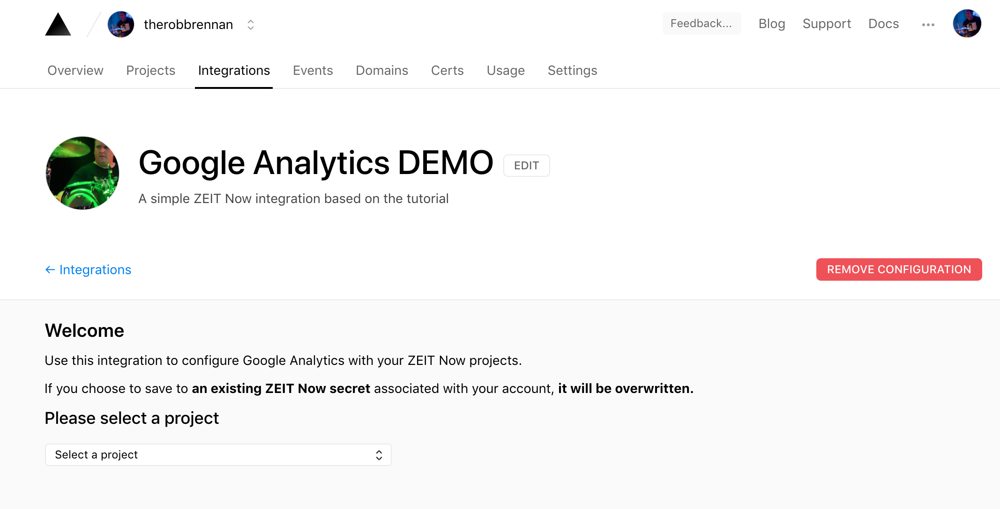
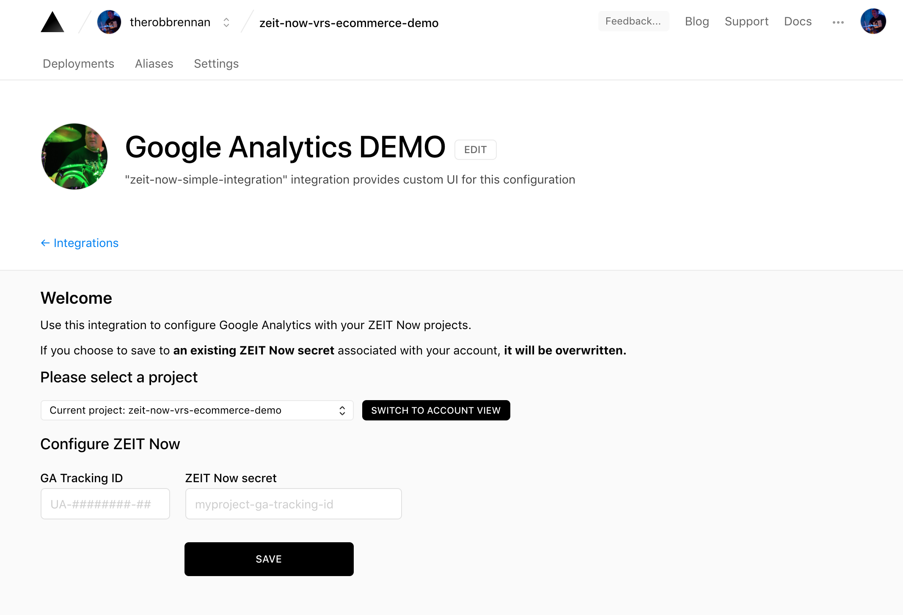
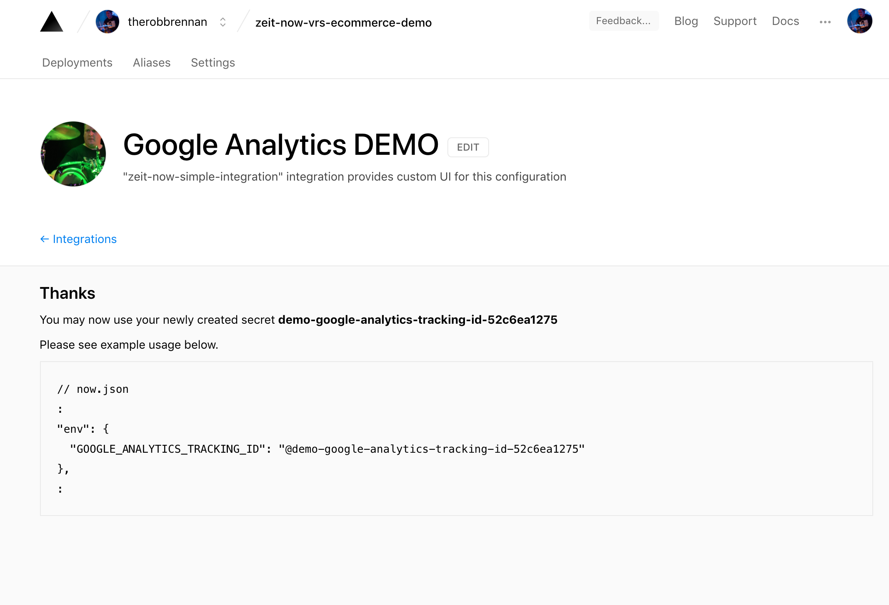

# Welcome

This project is the sample integration I created as part of the ZEIT Now Integrations Hackathon.

It is a simple example. The user selects one of their ZEIT Now projects, and has the ability to specify a tracking ID for Google Analytics and generate a secret that can be used in their `now.json` files:

Screenshots

## Getting started

This project is based on the tutorial available at [https://zeit.co/docs/integrations#creating-an-integration](https://zeit.co/docs/integrations#creating-an-integration)

**NOTE: According to the above [tutorial](https://zeit.co/docs/integrations#creating-an-integration), Safari has some issues when working with UIHooks running on `localhost`. Use a different web browser for local development.**

Once you have cloned this repo, you will want to do the following:

+ Create your integration on ZEIT Now
+ Add a configuration
+ Test your integration
+ Publish your integration

### Create your integration on ZEIT Now

Visit the [ZEIT Now Integrations Developer Console](https://zeit.co/dashboard/integrations/console) and click on `CREATE`

Fill out the form as guided - including the following values:

+ `Description` - Add a sentence or two to your liking
+ `Category` - Set this to `Experiments`
+ `Feature Images` - Add a publicly available image
+ `Privacy` - Leave as private unless you are really wanting to publish this publicly
+ `Redirect URL` - Leave this empty
+ `UI Hook URL` - Add `http://localhost:5005` to this field

### Add a configuration

Navigate to the [ZEIT Now Integrations Developer Console](https://zeit.co/dashboard/integrations/console) and select your newly created integration. Click on `View in Marketplace` and then click on `Add`.

Select the account you would like to add this integration to. Click `Add`.

### Test your integration

**IMPORTANT: DO NOT USE SAFARI** when trying to view your integration on `localhost`
